CueWeb System
==============

<picture>
  <source media="(prefers-color-scheme: dark)" srcset="public/opencue-icon-white.png">
  
</picture> &nbsp;&nbsp;**CueWeb**

# Contents

- [Introduction](#introduction)
- [Requirements](#requirements)
- [Installation and Usage](#installation-and-usage)
  - [Step-by-Step Instructions](#step-by-step-instructions)
    - [Setting up environment variables](#setting-up-environment-variables)
    - [Running the application with Docker](#running-the-application-with-docker)
    - [Access the CueWeb System](#access-the-cueweb-system)
  - [Authentication Setup](#authentication-setup)
    - [Configuration](#configuration)
      - [Example: Adding Gitlab authentication](#example-adding-gitlab-authentication)
      - [Custom Login Page](#custom-login-page)
- [Features](#features)
  - [Keyboard shortcuts](#keyboard-shortcuts)
    - [Below are some screenshots of the interface](#below-are-some-screenshots-of-the-interface)
- [Troubleshooting](#troubleshooting)
  - [Support resources](#support-resources)
- [Development](#development)
  - [Contributing](#contributing)
    - [Running application in dev mode with Docker](#running-application-in-dev-mode-with-docker)
    - [Testing application in dev mode with Docker](#testing-application-in-dev-mode-with-docker)

# Introduction

CueWeb is a web-based application that brings the core functionality of [CueGUI](https://github.com/AcademySoftwareFoundation/OpenCue/tree/master/cuegui), including Cuetopia and Cuecommander, to a web-accessible format. This initial version includes most Cuetopia features, with Cuecommander integration planned for the next phase. CueWeb simplifies rendering job management with customizable job tables, advanced filtering, detailed inspections, log viewing, and light/dark mode toggling, making it efficient and accessible across platforms. Finally, CueWeb leverages the [OpenCue REST Gateway](https://github.com/AcademySoftwareFoundation/OpenCue/tree/master/rest_gateway) to provide a REST endpoint for seamless interaction with the OpenCue gRPC API.

CueWeb replicates the core functionality of CueGUI (Cuetopia and Cuecommander) in a web-accessible format, enhancing usability while maintaining the familiar interface that users appreciate. This adaptation supports essential operations such as:

- **Global application header (persistent across every route):**
   - OpenCue logo (theme-aware: `opencue-icon-black.png` in light mode, `opencue-icon-white.png` in dark mode) followed by the **CueWeb** wordmark.
   - Six dropdown menus that mirror the CueGUI menu bar:
     - **File** → Disable Job Interaction (read-only safety toggle, see below).
     - **Cuebot Facility** → `local` · `dev` · `cloud` · `external` (overridable via `NEXT_PUBLIC_CUEBOT_FACILITIES`). The active facility is shown as a small chip on the menu trigger.
     - **Cuetopia** → Monitor Jobs.
     - **CueCommander** → Allocations, Limits, Monitor Cue, Monitor Hosts, Redirect, Services, Shows, Stuck Frame, Subscription Graphs, Subscriptions. Unimplemented routes 404 gracefully until the corresponding pages land.
     - **Other** → **Attributes** (toggles the docked Attributes panel, see below), **Show Shortcuts** (opens the same overlay as pressing `?`), **Notify on Shortcut** (toggles the per-shortcut toast).
     - **Help** → search box that searches *every* menu command in CueWeb (CueGUI parity), an **About CueWeb** dialog (build version + Build SHA + a **Copy diagnostics** button), plus links to the Online User Guide, Make a Suggestion, and Report a Bug (URLs overridable via `NEXT_PUBLIC_DOCS_URL` / `NEXT_PUBLIC_SUGGESTIONS_URL` / `NEXT_PUBLIC_BUGS_URL`).
   - Theme toggle on the right.
   - An always-visible **Sign out** button on the right. With an active session, `signOut()` clears it and redirects to `/login`; without a session it just navigates to `/login`. The `/login` page itself handles both auth configurations — empty `NEXT_PUBLIC_AUTH_PROVIDER` renders the **CueWeb Home** button, while a populated value renders the provider buttons.
   - When the user is signed in, the right-side cluster also shows the session's name or email next to the Sign out button.
- **Collapsible left sidebar (persistent across every route):**
   - Same six groups as the header, organized as accordion sections: **File**, **Cuebot Facility**, **Cuetopia**, **CueCommander**, **Other**, **Help**.
   - Each group is independently collapsible; the group containing the active route auto-expands on navigation.
   - One click on the **Collapse** button at the bottom shrinks the sidebar to an icon-only rail; the choice is persisted in `localStorage` under `cueweb.sidebar.collapsed`, and per-group open/closed state under `cueweb.sidebar.openGroups`.
   - Hidden on `/login`. Hidden on viewports smaller than the `md` breakpoint.
- **Disable Job Interaction (read-only safety mode):**
   - File ▸ Disable Job Interaction (header or sidebar) toggles a single global flag persisted under `localStorage["cueweb.safety.disable-job-interaction"]`.
   - When on, an amber **Read-only mode** banner is rendered just under the header with a *Re-enable* button, and every destructive action (jobs toolbar Pause / Unpause / Retry Dead Frames / Eat Dead Frames / Kill, plus the same items in the right-click context menus on job / layer / frame rows) is visually disabled and ignores clicks.
   - Cross-tab sync via the browser `storage` event, so toggling the flag in one tab is reflected in every other tab.
- **Attributes panel (Other ▸ Attributes):**
   - Docked drawer that displays a collapsible key/value tree for the currently-selected entity (click any row in the jobs table to populate it).
   - Position picker in the title bar lets the user dock the panel on the **right**, **bottom**, **left**, or **top** of the viewport. The choice persists under `cueweb.attributes.position`; open/closed state under `cueweb.attributes.open`.
   - Built-in filter input narrows the tree live; parent groups remain visible whenever any descendant matches.
- **Breadcrumb navigation on detail views:**
   - Above every detail page, a small "Home > Jobs > ..." trail shows the context path back to the jobs index. Currently rendered on the frame log page (`Home > Jobs > <jobName> > <layerName> > <frameName>`) and the per-job comments page (`Home > Jobs > <jobName> > Comments`).
   - Non-last segments are `next/link`s; the last segment is plain text with `aria-current="page"`.
   - Long segment labels truncate to `max-w-[40ch]` and show the full text in a tooltip on hover, so very long job names like `testing-test_shot-ramon_load_test_job_0001` stay legible without breaking the layout.
- **Bottom status bar (IDE-style, persistent across every route):**
   - 24-pixel-tall bar fixed to the bottom of the viewport with three metrics, each with a tooltip:
     1. **Gateway**: dot + `Online`/`Offline` + round-trip latency in milliseconds. Polled every 10 seconds via `/api/health` (a JWT-signed reachability probe against `/show.ShowInterface/GetActiveShows` with a 5-second timeout). When the gateway is unreachable, the bar's surface turns red so the failure is visible at a glance.
     2. **Last refresh**: live relative timestamp ("just now", "12s ago", "3m ago", ...). Updated whenever the jobs table fires a `cueweb:jobs-refreshed` CustomEvent (every 5 seconds while the table is mounted). Re-renders once per second so the relative time stays accurate without waiting for the next event.
     3. **Version**: `v<NEXT_PUBLIC_APP_VERSION>` (also shown in **Help → About CueWeb** alongside the Build SHA). Resolved once at build time, first hit wins: (1) the `NEXT_PUBLIC_APP_VERSION` env / build-arg (CI injects the OpenCue version or a SHA); (2) `OVERRIDE_CUEWEB_VERSION.in` - its default value `VERSION.in` tracks the repo-root `VERSION.in` (OpenCue's shared version, also read by Cuebot / CueGUI), while any other value is used verbatim as a CueWeb-specific override; (3) the `version` field in `package.json` as a last-resort fallback. The **Build SHA** comes from the `NEXT_PUBLIC_GIT_SHA` build-arg and shows `unknown` when unset.
   - Hidden on `/login*`; matches the chrome's translucent surface so it integrates with both light and dark themes.
- **Mobile-friendly UI:**
   - Every authenticated route works on phone-sized viewports. The Jobs page stacks its filter / toolbar / table vertically on small screens instead of forcing a wide layout, and each data table can be swiped horizontally to reach off-screen columns.
   - On phones the desktop sidebar is replaced by a **hamburger** menu in the global header. Tapping it opens a side drawer mirroring every sidebar group: Dashboard, File, Cuebot Facility, Cuetopia, CueCommander, Other (Attributes / Show Shortcuts / Notify on Shortcut), and Help. The drawer is scrollable and auto-closes when you tap a navigation link.
   - Every Jobs / Layers / Frames row has a small `⋮` Actions button as its leftmost cell, so touch users get the full right-click menu via a tap.
   - The keyboard-shortcuts overlay (Other ▸ Show Shortcuts or `?`) is itself touch-friendly: every key badge in the list is tappable, so users on phones can trigger `/`, `r`, and `t` from inside the dialog instead of needing a physical keyboard.
- **LAN access (CueWeb usable from phones / tablets):**
   - The same image works whether the browser reaches CueWeb at `localhost` on the dev machine or at a LAN IP from another device on the same Wi-Fi - no rebuild needed when you want to test on a phone. The build-time `NEXT_PUBLIC_URL` defaults to empty so the client targets whichever origin served the page; set it to an absolute URL only when your deployment serves the API on a different origin than the UI.
   - Copy actions (Copy Job Name / Copy Layer Name / Copy Frame Name / Copy Log Path) work even when CueWeb is loaded over plain HTTP on a LAN IP, where the browser's modern Clipboard API would otherwise be unavailable.
- **External editor integration:**
   - Optional **View Log on \<editor\>** item in the Frame right-click menu launches the log file directly in a desktop editor. Configured at build time via `NEXT_PUBLIC_LOG_EDITOR_URL`; `{path}` is substituted with the absolute log path at click time. Common values:
     - `vscode://file{path}` -> View Log on VSCode (the sandbox default)
     - `vscode-insiders://file{path}` -> View Log on VSCode Insiders
     - `subl://open?url=file://{path}` -> View Log on Sublime Text
     - `txmt://open?url=file://{path}` -> View Log on TextMate
     - `idea://open?file={path}` -> View Log on IntelliJ
     - Empty -> menu item hidden entirely
   - The menu label updates automatically based on the configured value.
   - If the editor isn't installed on the user's machine, CueWeb shows a warning toast after a short timeout pointing the user at the alternatives.
   - Web browsers can't read the user's shell `$EDITOR` variable or launch arbitrary local programs the way CueGUI does. The URL-scheme approach is the web equivalent: the same trick GitHub's "Open in VSCode" button uses.
- **User authentication:**
   - Secure login capabilities through Okta, Google, GitHub, and LDAP (configured via `NEXT_PUBLIC_AUTH_PROVIDER`).
   - The header and login page share the same OpenCue + CueWeb branding via the `CueWebIcon` component.
- **Job management dashboard:**
  - Customizable table views: hide/show columns AND reorder them left/right inside each table's **Columns** dropdown, with a pinned **Reset to Default** button that restores both visibility and order. Both states persist in `localStorage` per table (Jobs: `columnVisibility` / `columnOrder`; Layers: `cueweb.layers.columnVisibility` / `cueweb.layers.columnOrder`; Frames: `cueweb.frames.columnVisibility` / `cueweb.frames.columnOrder`).
  - CueGUI-parity Jobs columns: Name, **Comments** (sortable sticky-note column - sort to pull jobs with comments to the top), State, Done / Total, Running, Dead, Eaten, Wait, MaxRss, Age, Readable Age, **Launched**, **Eligible**, **Finished**, **User Color** (per-job color swatch persisted to `localStorage["cueweb.userColors"]` with cross-tab sync), Progress, Notify.
  - CueGUI-parity Layers columns: Dispatch Order, Name, Services, Limits, Range, Cores, Memory, Gpus, Gpu Memory, MaxRss, Total, Done, Run, Depend, Wait, Eaten, Dead, Avg, Tags, Progress (stacked animated bar with the same per-state palette as the Jobs progress bar), Timeout, Timeout LLU, **Eligible**.
  - CueGUI-parity Frames columns: Order, Frame, Layer, Status, Cores, GPUs, Host, Retries, CheckP, Runtime, **LLU** (only populated for `RUNNING` frames, matching CueGUI), **Memory (RSS)**, **Memory (PSS)**, GPU Memory, **Remain** (placeholder until the ETA predictor is wired in), Start Time, Stop Time, **Eligible Time**, **Submission Time**, **Last Line** (placeholder until the per-frame log-tail fetch is wired in).
  - Filter jobs by state (active, paused, or completed).
  - Per-table client-side substring filter: a small **Filter jobs / layers / frames...** input next to each Columns dropdown narrows the rows already loaded; resets to page 1 on every keystroke and keeps sorting, column visibility, column reordering and pagination working over the filtered subset.
  - Monitor or unmonitor jobs across various statuses.
  - Detailed job inspection inline below the jobs table: clicking a job row reveals the associated **Layers** and **Frames** panels. Clicking a layer row narrows the frames panel to that layer and pushes the layer's attributes into the docked Attributes panel. Double-clicking any frame row opens the log viewer.
  - Frame navigation with hyperlinks to logs and data pages.
  - Stacked job progress bar with a hover tooltip showing per-state frame counts and percentages (succeeded / running / waiting / depend / dead). The Layers table reuses the same `<ProgressBar/>` renderer with `getLayerProgressSegments` so per-layer progress matches the per-job style.
  - Frame state filter chips above the frames table (`WAITING`, `RUNNING`, `SUCCEEDED`, `DEAD`, `EATEN`, `DEPEND`) with per-state counts, OR-combined selection, and selection mirrored to the `frameStates` URL query parameter for bookmarkable/shareable filtered views.
  - CueGUI-parity right-click menus on every row, following the CueGUI Monitor Jobs and Monitor Job Details menu structure. Menus scroll instead of overflowing on small viewports; items not yet implemented surface a friendly placeholder toast.
  - Mobile-friendly equivalent of right-click: every Jobs / Layers / Frames row has a small `⋮` button as its leftmost cell. Tapping it opens the same context menu the desktop right-click opens, so touch users get the full action set without a right-click event.
  - Wired copy actions: **Copy Job Name** (Job menu); **Copy Layer Name** (Layer menu); **Copy Frame Name** + **Copy Log Path** (Frame menu). Each pushes the value to the clipboard with a confirmation toast. Works whether CueWeb is served from `localhost` or from a LAN IP over plain HTTP.
  - Wired log actions: double-clicking a frame row, choosing **View Log** / **Tail Log** from the right-click menu, and tapping the row's `⋮` button all navigate to the in-browser log viewer. A new **View Log on \<editor\>** item appears in the Frame menu when `NEXT_PUBLIC_LOG_EDITOR_URL` is set (see the **External editor integration** bullet above). When the frame hasn't started running yet (no log file on disk), every log action surfaces a friendly warning toast instead.
- **Job search functionality:**
   - Search for jobs using show names followed by a hyphen.
   - Dropdown suggestions for matching jobs based on naming conventions like show1-shot-test_job_123.
   - Regex-enabled search (triggered by !) for advanced query patterns, with a tooltip for guidance.
- **Dark mode toggle:**
   - Allows users to switch between light and dark themes.
- **Optimized search and results loading:**
   - Virtualized lists via FixedSizeList to improve performance.
   - Web worker implementation for filtering, reducing main thread workload.
   - Loading animations and efficient API call handling.
- **Multi-job management:**
   - Add or remove multiple jobs from the dashboard directly from search results.
   - Highlight jobs already in the table with a green indicator.
- **Actions and context menu**
   - Added actions for jobs, layers, and frames, including pause, unpause, retry, kill, and eat dead frames.
   - Option to un-monitor all/selected/finished/paused jobs in the jobs data table.
   - Context-sensitive menus disable options for completed jobs and ensure proper screen rendering.
- **Table auto-reloading:** 
   - All tables (jobs, layers, frames) now update at regular intervals for real-time data.
- **View frame logs:**
   - View previous and current log versions with a dropdown menu for selection
- **Authorization and security:**
   - Authorization headers included in all REST gateway requests.
   - JWT tokens generated securely for API authentication.

Go back to [Contents](#contents).

# Requirements

**Core technologies:**
- **[Node.js](https://nodejs.org):** Essential for server-side logic.
- **[Next.js](https://nextjs.org):** Utilized for server-side rendering and static generation.
- **[Next-Auth.js](https://next-auth.js.org):** Implements authentication mechanisms.
- **[Shadcn UI](https://ui.shadcn.com/):** Used for UI components.

**Operating system compatibility:**
- CueWeb is designed to be platform-independent, functioning seamlessly on macOS, Windows, and Linux. There are no specific OS version requirements.

**Dependency versions:**
- For precise version information on all dependencies, consult the `package.json` file located in the project repository. This resource ensures you have the correct versions of the required libraries to run CueWeb effectively.

**Docker support:**
- If you prefer a containerized environment, ensure [Docker](https://docs.docker.com/get-docker) is installed to facilitate the deployment of CueWeb.

Go back to [Contents](#contents).

# Installation and Usage

Next is the process to install and use the CueWeb system.

## Step-by-Step Instructions

### Setting up environment variables

- To run CueWeb, certain environment variables must be set for the application to run as intended. Set up the following environment variables, either by adding them to the docker file directly (`ENV MY_ENV_VARIABLE="value"`), or adding a `.env` file in `/cueweb` where these variables are configured (if you do the latter, make sure you copy in that file in the docker file i.e: `COPY .env /opt/cueweb/.env`). If your application will be deployed on Openshift, those environment variables can be configured there as well.
    - NEXT_PUBLIC_OPENCUE_ENDPOINT
        - This is a gateway that provides a REST endpoint to the opencue gRPC API. This is needed for jobs, layers, and frames to be retrieved. See [Opencue REST Gateway](https://github.com/AcademySoftwareFoundation/OpenCue/blob/master/rest_gateway/README.md).
        - This means that this rest gateway must be set-up and the environment variable should be set to the url for rest gateway.
    - NEXT_PUBLIC_URL
        - This is the URL where CueWeb is hosted and accessible by users ex: localhost:3000
    - NEXT_JWT_SECRET
        - This is used to create a JWT token which is required to access the REST endpoint of the opencue gRPC API

    - CueWeb authentication environment variables
        - Depending on which [Next-Auth.js](https://next-auth.js.org/) provider you use for authentication, you may have to set certain environment variables. 
        - For example, for authentication (see file `cueweb/lib/auth.ts`), the following environment variables must be set:
            - `NEXT_PUBLIC_AUTH_PROVIDER=github,okta,google` will show the three authentication buttons (Okta, Google, GitHub).
            - `NEXT_PUBLIC_AUTH_PROVIDER=github,google` will show the two authentication buttons (GitHub and Google).
            - `NEXT_PUBLIC_AUTH_PROVIDER=google` will show only the Google (Gmail) authentication button.

            - [Okta](https://www.okta.com/)
                - NEXT_AUTH_OKTA_CLIENT_ID
                - NEXT_AUTH_OKTA_ISSUER
                - NEXT_AUTH_OKTA_CLIENT_SECRET
            - Google (Gmail)
                - GOOGLE_CLIENT_ID
                - GOOGLE_CLIENT_SECRET
            - GitHub
                - GITHUB_ID
                - GITHUB_SECRET
        - To disable the CueWeb authentication, do not define `NEXT_PUBLIC_AUTH_PROVIDER`.
            - Note that all the CueWeb environment variables are defined in build time (`cueweb/Dockerfile`), including the `NEXT_PUBLIC_AUTH_PROVIDER`, so define if the CueWeb will use or not authentication will be defined in the build time.
        Change `.env` from:
        ```env
        # Authentication Configuration:
        NEXT_PUBLIC_AUTH_PROVIDER=github,okta,google
        ```
        to
        ```env
        # Authentication Configuration:
        # NEXT_PUBLIC_AUTH_PROVIDER=github,okta,google
        ```

    - Sentry environment variables
        - If you use [Sentry](https://sentry.io/) system to monitor the CueWeb application, the following environment variables should be set:
            - SENTRY_ENVIRONMENT
            - SENTRY_URL
            - SENTRY_DSN
            - SENTRY_ORG
            - SENTRY_PROJECT
        - If you do not want to use Sentry, do not define `SENTRY_DSN`.
        Change `.env` from:
        ```env
        # Sentry values
        SENTRY_ENVIRONMENT='development'
        SENTRY_DSN = sentrydsn
        SENTRY_URL = sentryurl
        SENTRY_ORG = sentryorg
        SENTRY_PROJECT = sentryproject
        ```
        to
        ```env
        # Sentry values
        SENTRY_ENVIRONMENT='development'
        # SENTRY_DSN = sentrydsn
        SENTRY_URL = sentryurl
        SENTRY_ORG = sentryorg
        SENTRY_PROJECT = sentryproject
        ```

Example of `.env` file (`cueweb/.env.example`):

```env
NEXT_PUBLIC_OPENCUE_ENDPOINT=http://your-rest-gateway-url.com

# Sentry values
SENTRY_ENVIRONMENT='development'
SENTRY_DSN = sentrydsn
SENTRY_URL = sentryurl
SENTRY_ORG = sentryorg
SENTRY_PROJECT = sentryproject

# Authentication Configuration:
NEXT_PUBLIC_AUTH_PROVIDER=github,okta,google
NEXTAUTH_URL=http://localhost:3000
NEXTAUTH_SECRET=canbeanything

# values from Okta OAuth 2.0
NEXT_AUTH_OKTA_CLIENT_ID=oktaid
NEXT_AUTH_OKTA_ISSUER=https://company.okta.com
NEXT_AUTH_OKTA_CLIENT_SECRET=oktasecret

# values from Google Cloud Platform OAuth 2.0
GOOGLE_CLIENT_ID=googleclientid
GOOGLE_CLIENT_SECRET=googleclientsecret

# values from Github OAuth 2.0
GITHUB_ID=githubid
GITHUB_SECRET=githubsecret
```

Go back to [Contents](#contents).

### Running the application with Docker
- Make sure [Docker](https://www.docker.com/) is installed
- A `Dockerfile` is provided in the CueWeb project (`cueweb/Dockerfile`)
- `docker build -f Dockerfile -t cueweb .`
- `docker run -p 3000:3000 -it cueweb`
    - To see a frame's logs, make sure the path to that frame's log directory is accessible within your docker container (if not, you should mount the directory).

Go back to [Contents](#contents).

### Access the CueWeb System

- Open your web browser and navigate to `localhost:3000` or `<ip>:3000` or the configured CueWeb url to start using the CueWeb system. 
- Replace `<ip>` with the actual IP address if you are accessing the system from a different machine in your network.

Go back to [Contents](#contents).

## Authentication Setup 
The CueWeb project utilizes the [NextAuth.js](https://next-auth.js.org/) library for authentication, which includes many popular providers out-of-the-box for additional configuration or for implementing your own email authentication with a custom database. This project already implements Google, Github and Okta authentication and they are enabled if their respective environment variables are provided, otherwise ignored. 

Authentication providers in [NextAuth.js](https://next-auth.js.org/) are services that can be used to sign in to a user.

There are four ways a user can be signed in:

- [Using a built-in OAuth Provider](https://next-auth.js.org/configuration/providers/oauth) (e.g Github, Google, Okta, Apple, GitLab, Amazon, Microsoft Azure, LinkedIn, Atlassian, Auth0, etc...)
   - List of NextAuth.js providers: https://next-auth.js.org/providers/.
- [Using a custom OAuth Provider](https://next-auth.js.org/configuration/providers/oauth#using-a-custom-provider)
- [Using Email](https://next-auth.js.org/configuration/providers/email)
- [Using Credentials](https://next-auth.js.org/configuration/providers/credentials)

Go back to [Contents](#contents).

### Configuration

To enable Okta, Google, Github or LDAP authentication, simply set the environment variable
`NEXT_PUBLIC_AUTH_PROVIDER` to either `google`, `okta`, `github`, `ldap` or all of them combined separated by comma
(e.g. `google,okta,github,ldap`) along with  the OAuth 2.0 secrets listed in `lib/auth.ts`. 
For example, providing the `GOOGLE_CLIENT_ID`, 
`GOOGLE_CLIENT_SECRET` Google OAuth 2.0 environment variables and setting `NEXT_PUBLIC_AUTH_PROVIDER=google`
will automatically enable google authentication. See `.env.example` on a list of environment variables to provide.

Go back to [Contents](#contents).

#### Example: Adding Gitlab authentication

In `lib/auth.ts`, add the following lines of code:
```tsx
if (process.env.GITLAB_CLIENT_ID && process.env.GITLAB_CLIENT_SECRET) {
  providers.push(
    GitlabProvider({
      clientId: process.env.GITLAB_CLIENT_ID,
      clientSecret: process.env.GITLAB_CLIENT_SECRET
    })
  )
}
```
After this, NextAuth will automatically build and display the Sign In page at `cueweb.com/api/auth/signin`.

For a complete list of available providers, visit here:
- https://next-auth.js.org/providers/

To configure custom authentication:
- https://next-auth.js.org/configuration/providers/oauth#using-a-custom-provider

Go back to [Contents](#contents).

#### Custom Login Page

An Example on how to implement custom login page is shown in `app/login/page.tsx`. To add Google authentication,
simply use the `signIn` function from nextAuth and pass the provider name as parameter.

```tsx
// app/login/page.tsx
import { signIn } from "next-auth/react";
import { GoogleSignInButton } from "@/components/ui/auth-button"

export default function Page() {
    ...
    // SignIn Function: redirects user to google signin page on click 
    const googleLogin = async () => {
        signIn("google", { callbackUrl: "/"});
    };
    ...
    return (
        <div>
            {/*Button with google Icon*/}
            <GoogleSignInButton onClick={googleLogin}/>
        </div>
    );
}
```

Go back to [Contents](#contents).

# Features

The current CueWeb system offers a robust set of features designed to enhance user interaction and productivity:

- **Persistent global header:** OpenCue logo + **CueWeb** wordmark, grouped **Cuetopia / CueCommander** dropdown navigation matching the CueGUI Views/Plugins menu, theme toggle, and an always-visible Sign out button.
- **Authentication:** Secure login via Okta, Google, GitHub, and LDAP.
- **Jobs / Layers / Frames tables (CueGUI parity):**
  - Full CueGUI-parity columns including Launched / Eligible / Finished / User Color (Jobs), Eligible (Layers), and LLU / Memory (RSS) / Memory (PSS) / Remain / Eligible Time / Submission Time / Last Line (Frames).
  - Show/hide AND reorder columns (`←` / `→` arrows in the **Columns** dropdown) with a one-click **Reset to Default**.
  - Per-table substring filter input (CueGUI-style narrowing of already-loaded rows).
  - Animated stacked progress bar on both Jobs and Layers with a hover tooltip showing per-state frame counts and percentages.
  - Frame state filter chips above the frames table (`WAITING`, `RUNNING`, `SUCCEEDED`, `DEAD`, `EATEN`, `DEPEND`) with URL-persisted selection.
- **Search:** Advanced search with regex support, dropdown suggestions, and optimized loading.
- **Dark mode:** Toggle between light and dark themes.
- **Actions:** Job, layer, and frame actions (pause, retry, kill, eat, and others) through CueGUI-parity right-click context menus. Includes **View Job Details** (opens the tabbed `/jobs/<jobName>` page with Overview / Layers / Frames / Comments / Dependencies), **Set Priority...** (themed 1-100 slider + number input dialog with optimistic in-row update; available on both Cuetopia Monitor Jobs and CueCommander Monitor Cue), Copy Job / Layer / Frame Name, Copy Log Path, View Log + Tail Log, and an optional **View Log on <editor>** item that launches the rqlog in VSCode / Sublime / TextMate / IntelliJ via a custom URL scheme (configured at build time, default is VSCode).
- **CueSubmit (browser job submission):** dedicated `/cuesubmit` route reachable from the **CueSubmit** top-level dropdown in the header, the matching **CueSubmit > Submit Job** group in the left sidebar, and the mobile nav drawer. Mirrors the standalone CueSubmit CLI tool with Job Info / Layer Info / per-type panels for Shell / Maya / Nuke / Blender, a live read-only Final command preview that updates per-keystroke, and a multi-layer Submission Details table with add / remove / reorder controls. Browser-only conveniences: per-field autocomplete history (Job Name / Shot / Layer Name), draft auto-save so refreshes don't wipe a multi-layer setup, themed `?` help popovers for frame-spec patterns and cuebot tokens, themed Radix Reset-confirm dialog, and a **View in Monitor Jobs** deep-link button on the resulting job detail page. Sandbox-tuned defaults (Memory `256m`, Facility `local`, stable non-zero per-user UID) so a `sleep 5` test job runs end-to-end out of the box.
- **Email Artist:** right-click a job and pick **Email Artist...** to open a themed dialog mirroring CueGUI's Email dialog (From / To / CC / BCC / Subject / Body), pre-filled from the job (artist as **To**, `<show>-<suffix>@<domain>` as **From** / **CC**, `cuemail: please check <jobName>` as **Subject**) and editable. Send hands the result to the user's default mail client via a `mailto:` URL. Configure the placeholders at build time with `NEXT_PUBLIC_EMAIL_DOMAIN` (default `your.domain.com`) and `NEXT_PUBLIC_EMAIL_SUPPORT_SUFFIX` (default `pst`).
- **Request Cores:** right-click a job and pick **Request Cores...** to open a themed email composer mirroring CueGUI's `RequestCoresDialog`, pre-filled with **From** (your signed-in session), **CC** (`<show>-support@<domain>`), and **Subject** (`Requesting Cores for <jobName>`); the body is auto-populated with a fixed-width table of the job's still-active layers (Layer Name / Minimum Memory / Min Cores), followed by editable **Date/Time by which completion is needed** and **Additional notes** sections. Send hands the result to your default mail client via a `mailto:` URL. Configure the support-team alias at build time with `NEXT_PUBLIC_EMAIL_REQUEST_CORES_SUFFIX` (default `support`).
- **Mobile-friendly UI:** every authenticated route works on phone viewports. Hamburger-triggered nav drawer on phones, per-row `⋮` Actions button so touch users get the right-click menu via a tap, horizontally swipeable wide data tables, and tappable key badges in the shortcuts overlay so `/` / `r` / `t` are reachable without a physical keyboard.
- **LAN access:** the client builds same-origin relative URLs for every API call by default, so the app loads correctly from any host (`http://<lan-ip>:3000` from a phone, `http://localhost:3000` on the dev Mac). Clipboard has an `execCommand("copy")` fallback for plain-HTTP LAN deployments where the modern Clipboard API is unavailable.
- **Auto-reloading:** Real-time updates for tables.
- **Job-finished notifications (two channels):** A per-row **Notify bell** subscribes the browser - a background poller fires a toast (and an optional desktop popup when notification permission is granted) when the job reaches `FINISHED`; subscriptions persist in `localStorage`, sync across tabs, and the notify decision is serialized cross-tab via the Web Locks API so only one tab toasts when several poll the same job. The right-click **Subscribe to Job** menu entry opens a CueGUI-parity dialog that registers an *email* subscriber on Cuebot via the `AddSubscriber` RPC, so Cuebot mails the saved address when the job finishes. The two channels are independent.
- **Job dependencies (CueGUI parity):** the job right-click menu groups four entries together. **View Dependencies...** opens a themed dialog mirroring CueGUI's `DependDialog` - a Type / Target / Active / OnJob / OnLayer / OnFrame table backed by the `GetDepends` RPC, with a **Refresh** button. **Dependency Wizard...** is a multi-step state machine covering every CueGUI `depend.DependType` (Job-On-Job / Layer / Frame, Frame By Frame for all layers / Hard Depend, Layer-On-Job / Layer / Frame, Frame By Frame, Frame-On-Job / Layer / Frame, Layer on Simulation Frame); every picker (source layers / frames, target jobs / layers / frames) is multi-select and Done fires the full source x target cross-product in one bulk batch. The Hard Depend variant pairs source/target layers by `layer.type` and fans out one `CreateFrameByFrameDependency` per matched pair across every picked target job. **Drop External Dependencies** and **Drop Internal Dependencies** call the `DropDepends` RPC with `target = EXTERNAL` / `INTERNAL` respectively; on success they dispatch `cueweb:refresh-now` and `cueweb:depends-changed` so the Jobs table re-polls and the Group-By Dependent tree cache rebuilds immediately.
- **Redirect (CueCommander parity):** an admin tool at `/redirect` that moves cores to a job that needs them by reassigning busy procs to a target job (killing the frames on those procs). Job + resource filters (Show, Include Groups, Require Services, Exclude Regex, Allocations, Min/Max Cores, Min Memory, Result Limit, Proc Hour Cutoff) drive a `ProcInterface/GetProcs` search; typing a target job auto-detects its Show and core/memory needs; the redirect (`HostInterface/RedirectToJob`) refuses an invalid/maxed target and warns before a paused-target or cross-show redirect.
- **Stuck Frames (CueCommander -> Stuck Frame):** a stuck-frame finder at `/stuck-frames`, the CueWeb equivalent of CueGUI's CueCommander Stuck Frame window. Scans every running frame across active jobs and flags the ones whose log has gone silent relative to runtime, grouped under their job, with columns Name / Frame / Host / LLU / Runtime / % Stuck / Average / Last Line and **Auto-refresh** / **Refresh** / **Clear** controls. Detection thresholds run client-side and persist per browser (% of Run Since LLU, Min LLU, % Avg Completion, Total Runtime, Exclude Keywords), with a **+** button to add per-service filter rows so long-running services (e.g. Arnold) can use looser limits than quick ones. Frame right-click actions: Tail / View / View Last Log, Retry / Eat / Kill, Log Stuck Frame (and Log and Retry / Eat / Kill), Frame Not Stuck, Add Job to Excludes / Exclude and Remove Job, **Core Up** (raise the layer's minimum cores), and View Host; job-header actions add View Comments, Job Not Stuck, and Core Up across the job's stuck layers.
- **Logs:** View current and previous logs via dropdown.
- **Security:** Use JWT-based authorization and secure headers.
- **Keyboard shortcuts:** Press `?` anywhere in the app to open a cheat-sheet overlay; the same overlay is also reachable from **Other ▸ Show Shortcuts** in the header or the sidebar. An optional **Notify on Shortcut** toggle (also under Other) fires a toast naming the shortcut that just triggered. See [Keyboard shortcuts](#keyboard-shortcuts) below for the full list.

Go back to [Contents](#contents).

## Keyboard shortcuts

CueWeb registers a small set of global keyboard shortcuts (mounted from `cueweb/app/layout.tsx` via `KeyboardShortcuts` in `cueweb/components/ui/shortcuts-overlay.tsx`). Single-letter shortcuts are ignored while typing into a text field, and modifier-key combos (Ctrl / Cmd / Alt) are passed through to the browser, so they will not collide with native shortcuts such as Ctrl+R (full page reload).

| Key | Action | Where it works |
|-----|--------|----------------|
| `?` | Open this keyboard-shortcuts overlay | Anywhere |
| `Esc` | Close the overlay | Inside the overlay |
| `/` | Focus the jobs search box | On the jobs page (`/`) |
| `r` | Refresh the jobs table | On the jobs page (`/`) |
| `t` | Toggle the light / dark theme | Anywhere |

The same overlay is also reachable from the menu, for users who prefer mouse navigation:

- **Header ▸ Other ▸ Show Shortcuts**
- **Sidebar ▸ Other ▸ Show Shortcuts** (both expanded and collapsed sidebar modes)

Both menu items dispatch a `cueweb:open-shortcuts` `CustomEvent` on `window` that the overlay listens for.

**Notify on Shortcut** — when this menu toggle is checked (default ON), every triggered shortcut also fires a small toast naming the action: e.g. pressing `r` toasts `Shortcut: r → Refresh table`. The pref persists under `localStorage["cueweb.shortcutNotifications"]` and is read imperatively at fire-time, so flipping the toggle takes effect on the very next keypress without a reload.

Cross-component wiring uses `window` `CustomEvent`s (`cueweb:focus-search`, `cueweb:refresh-now`, `cueweb:open-shortcuts`) so any page that wants to participate can subscribe without a prop drill - see the `JobSearchbox` and jobs `data-table` for the existing consumers.

Go back to [Contents](#contents).

### Below are some screenshots of the interface

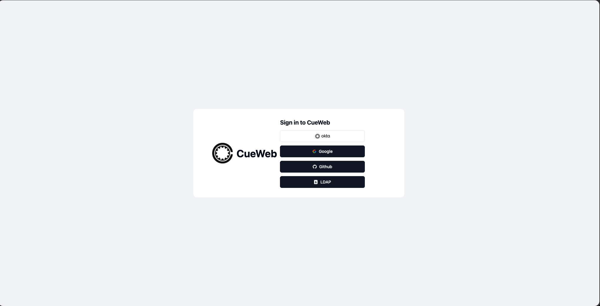
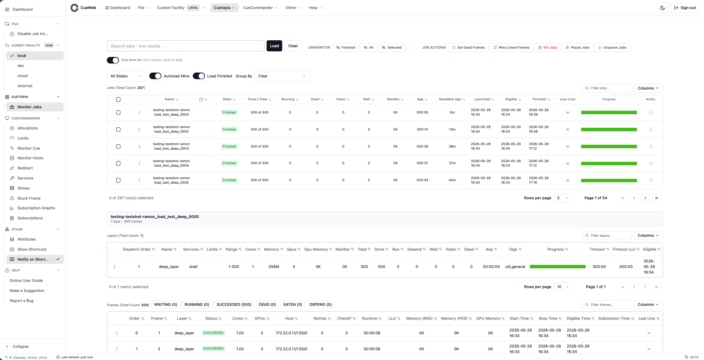
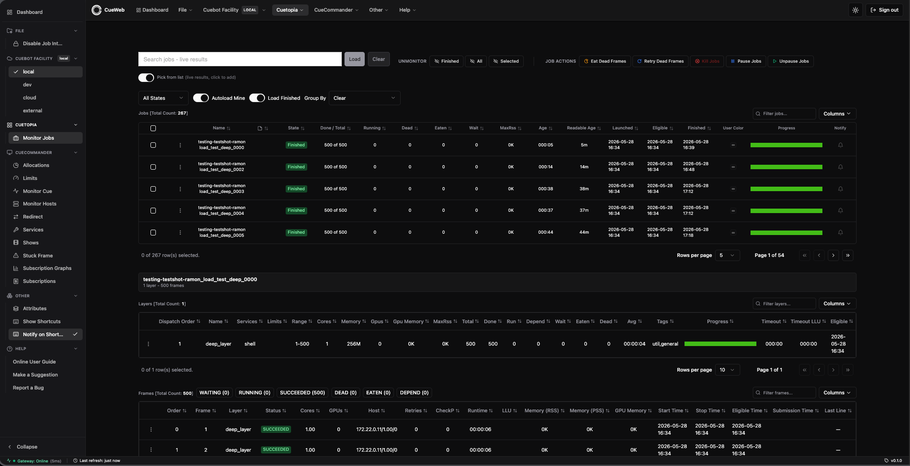
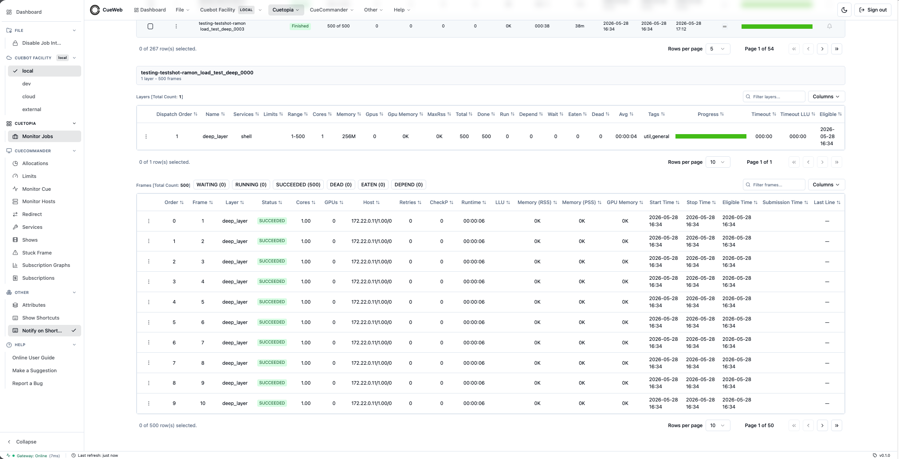
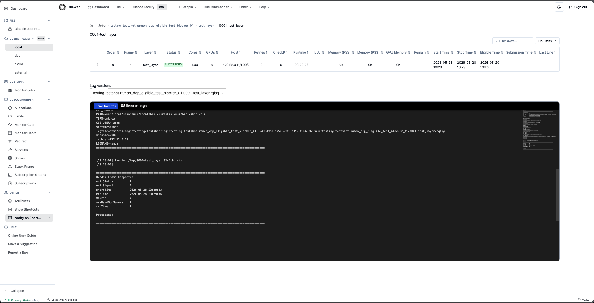
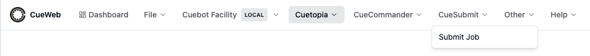
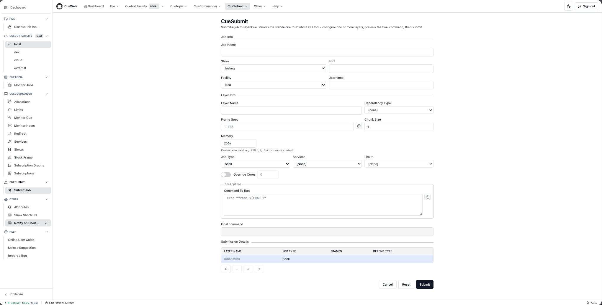
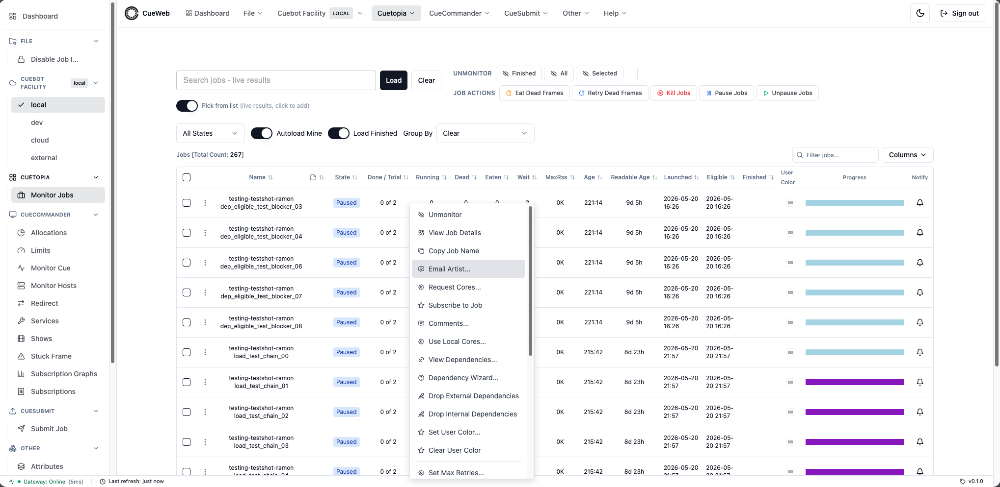
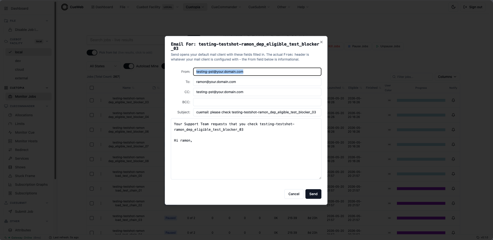
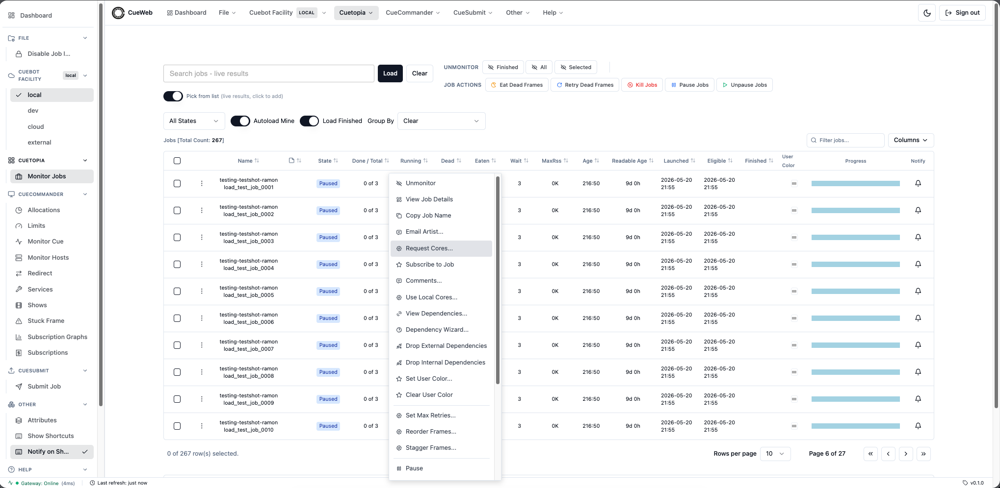
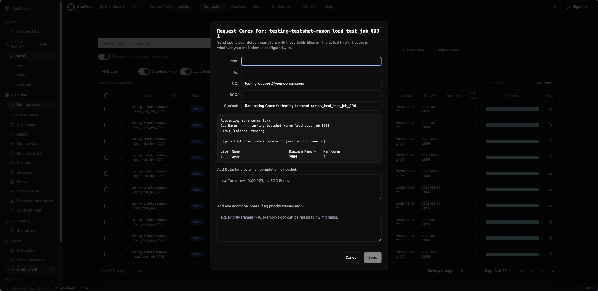

Go back to [Contents](#contents).

# Troubleshooting

Next are the support resources.

## Support resources

For assistance and further information:

- **Documentation:** Visit the [OpenCue Official Documentation](https://www.opencue.io/docs/) for comprehensive guides and tutorials.
- **Issue reporting:** Encounter a problem? Report it on our [GitHub issues page](https://github.com/AcademySoftwareFoundation/OpenCue/issues) to get help from the community and our development team.

Go back to [Contents](#contents).

# Development

## Contributing
Submit a pull request [here](https://github.com/AcademySoftwareFoundation/OpenCue/pulls) to contribute to CueWeb.

Go back to [Contents](#contents).

### Running application in dev mode with Docker
- When developing and testing CueWeb locally, it’s best to run `npm run dev` rather than `npm run build` and `npm run start` (this is for creating production builds)
    - `npm run dev` allows for live development, meaning you can make some code changes and see your changes applied right away
- To do so, start container with `bin/sh` as the entry command, and run `npm run dev` within the container to start the server 
    - Comment out the lines below "for production builds" and un-comment “CMD [‘bin/sh’]” in the Dockerfile 
- Run application:
    - sudo docker run -p 3000:3000 \
    -v <path_to_cueweb_repo>:/opt/cueweb \
    -it cueweb

- Don’t forget to mount your local code i.e. don’t forget: `-v <path_to_cueweb_repo>:/opt/cueweb`
    - This is important so that your code changes are picked up

- Make sure environment variables are set

Go back to [Contents](#contents).

### Testing application in dev mode with Docker
- To run the Jest unit tests in Docker, uncomment `CMD ["npm, "run", "test"]` in the Dockerfile or run `npm run test` in the terminal
- Test coverage includes:
    - Loading environment variables and verifying them
    - Creating json web tokens
    - Fetching objects from the gRPC REST gateway and handling errors
    - And more

Go back to [Contents](#contents).
