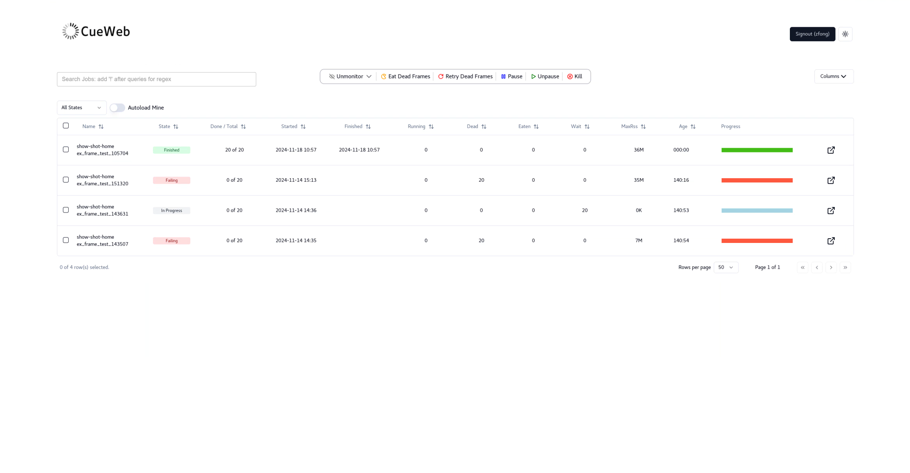
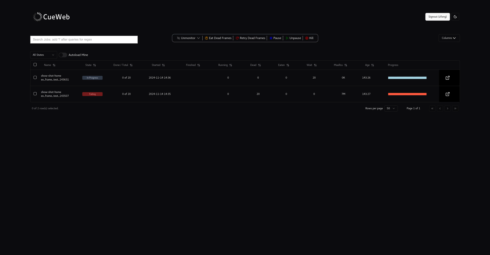

CueWeb System
==============


# Contents

1. [Introduction](#introduction)
2. [Requirements](#requirements)
3. [Installation and Usage](#installation-and-usage)
    1. [Step-by-step Instructions](#step-by-step-instructions)
        1. [Setting up environment variables](#setting-up-environment-variables)
        2. [Running the application with Docker](#running-the-application-with-docker)
        3. [Access the CueWeb System](#access-the-cueweb-system)
4. [Features](#features)
5. [Troubleshooting](#troubleshooting)
    1. [Support resources](#support-resources)
6. [Development](#development)
    1. [Contributing](#contributing)
       1. [Running application in dev mode with Docker](#running-application-in-dev-mode-with-docker)
       2. [Important note about jobs table data](#important-note-about-job-table-data)
    2. [Project structure](#project-structure)
    3. [UI Design](#ui-design)
    4. [About Next.js](#about-nextjs)


# Introduction

CueWeb serves as the web-based counterpart to [CueGUI](https://www.opencue.io/docs/reference/cuegui-app/), utilizing [Next.js](https://nextjs.org/) to extend the functionalities of the [OpenCue](https://www.opencue.io/) system to a broader, web-accessible platform. This adaptation allows users to manage their rendering jobs conveniently through a user-friendly web interface. Key features include the ability to log in, view, and filter job data; access detailed information on layers, frames, and logs; and unmonitor jobs as needed.

The current iteration of CueWeb is designed for read-only interactions. While it enables comprehensive viewing options, it does not yet support several actions which are planned for future updates:

- Terminating jobs ("kill job")
- Handling of "dead" frames, including reprocessing ("retry dead frames") and deletion ("eat dead frame")
- Pausing and unpausing of jobs

We are actively working on including these features in future releases of CueWeb. The goal is to enhance the CueWeb system's capabilities to ensure it meets the needs of our users comprehensively. If you have specific suggestions or would like to [contribute to the Opencue project](https://www.opencue.io/contributing/opencue/contributing/) to the development of these features, please refer to our contributing guidelines or contact us directly. Stay tuned to our upcoming releases for updates on these features.

Go back to [Contents](#contents).


# Requirements

**Core technologies:**
- **[Node.js](https://nodejs.org):** Essential for server-side logic.
- **[Next.js](https://nextjs.org):** Utilized for server-side rendering and static generation.
- **[Next-Auth.js](https://next-auth.js.org):** Implements authentication mechanisms.
- **[Shadcn UI](https://ui.shadcn.com/):** Used for UI components.

**Operating system compatibility:**
- CueWeb is designed to be platform-independent, functioning seamlessly on macOS, Windows, and Linux. There are no specific OS version requirements.

**Dependency versions:**
- For precise version information on all dependencies, consult the `package.json` file located in the project repository. This resource ensures you have the correct versions of the required libraries to run CueWeb effectively.

**Docker support:**
- If you prefer a containerized environment, ensure [Docker](https://docs.docker.com/get-docker) is installed to facilitate the deployment of CueWeb.

Go back to [Contents](#contents).


# Installation and Usage

Next is the process to install and use the CueWeb system.

Go back to [Contents](#contents).


## Step-by-Step Instructions

### Setting up environment variables

- To run CueWeb, certain environment variables must be set for the application to run as intended. Set up the following environment variables, either by adding them to the docker file directly (`ENV MY_ENV_VARIABLE="value"`), or adding a `.env` file in `/cueweb` where these variables are configured (if you do the latter, make sure you copy in that file in the docker file i.e: `COPY .env /opt/cueweb/.env`). If your application will be deployed on Openshift, those environment variables can be configured there as well.
    - NEXT_PUBLIC_OPENCUE_ENDPOINT
        - This is a gateway that provides a REST endpoint to the opencue gRPC API. This is needed for jobs, layers, and frames to be retrieved. See [this PR](https://github.com/AcademySoftwareFoundation/OpenCue/pull/1355).
        - This means that this rest gateway must be set-up and the environment variable should be set to the url for rest gateway.

    - Authentication environment variables
        - Depending on which provider you use for authentication, you may have to set certain environment variables. 
        - For example, for authentication (see file `cueweb/lib/auth.ts`), the following environment variables must be set:
          - NEXT_PUBLIC_OPENCUE_ENDPOINT
            - Example: 
              - `NEXT_PUBLIC_AUTH_PROVIDER=github,okta,google` will show the three authentication buttons (Okta, Google, GitHub).
              - `NEXT_PUBLIC_AUTH_PROVIDER=github,google` will show the two authentication buttons (GitHub and Google).
              - `NEXT_PUBLIC_AUTH_PROVIDER=google` will show only the Google (Gmail) authentication button.

          - [Okta](https://www.okta.com/)
              - NEXT_AUTH_OKTA_CLIENT_ID
              - NEXT_AUTH_OKTA_ISSUER
              - NEXT_AUTH_OKTA_CLIENT_SECRET
          - Google (Gmail)
            - GOOGLE_CLIENT_ID
            - GOOGLE_CLIENT_SECRET
          - GitHub
            - GITHUB_ID
            - GITHUB_SECRET

    - Sentry environment variables
        - If you use [Sentry](www.sentry.io) system to monitor your application, the following environment variables should be set:
            - SENTRY_ENVIRONMENT
            - SENTRY_URL
            - SENTRY_DSN
            - SENTRY_ORG
            - SENTRY_PROJECT

Example of `.env` file (`cueweb/.env.example`):

```env
NEXT_PUBLIC_OPENCUE_ENDPOINT=http://company.com/job.JobInterface/GetJobs

SENTRY_ENVIRONMENT_CUEWEB='development'


# Authentication Configuration:

NEXT_PUBLIC_AUTH_PROVIDER=github,okta,google
NEXTAUTH_URL=http://localhost:3000
NEXTAUTH_SECRET=canbeanything

# values from Okta OAuth 2.0
NEXT_AUTH_OKTA_CLIENT_ID=oktaid
NEXT_AUTH_OKTA_ISSUER=https://company.okta.com
NEXT_AUTH_OKTA_CLIENT_SECRET=oktasecret

# values from Google Cloud Platform OAuth 2.0
GOOGLE_CLIENT_ID=googleclientid
GOOGLE_CLIENT_SECRET=googleclientsecret

# values from Github OAuth 2.0
GITHUB_ID=githubid
GITHUB_SECRET=githubsecret
```

Go back to [Contents](#contents).


### Running the application with Docker
- Make sure [Docker](www.docker.com) is installed
- A `Dockerfile` is provided in the CueWeb project (`cueweb/Dockerfile`)
- `docker build -f Dockerfile -t cueweb .`
- `docker run -p 3000:3000 -it cueweb`
    - To see a frame's logs, make sure the path to that frame's log directory is accessible within your docker container (if not, you should mount the directory).

Go back to [Contents](#contents).


### Access the CueWeb System

- Open your web browser and navigate to `localhost:3000` or `<ip>:3000` to start using the CueWeb system. 
- Replace `<ip>` with the actual IP address if you are accessing the system from a different machine in your network.

Go back to [Contents](#contents).


## Authentication Setup: 
This project utilizes the NextAuth.js library for authentication, which includes many popular providers out-of-the-box for additional configuration or for implementing your own email authentication with a custom database. This project already implements Google, Github and Okta authentication and they are enabled if their respective environment variables are provided, otherwise ignored. 


### Configuration:

To enable Okta, Google or Github authentication, simply set the environment variable
`NEXT_PUBLIC_AUTH_PROVIDER` to either `google`, `okta`,`github` or all of them combined seperated by comma
(e.g. `google,okta,github`) along with  the OAuth 2.0 secrets listed in `lib/auth.ts`. 
For example, providing the `GOOGLE_CLIENT_ID`, 
`GOOGLE_CLIENT_SECRET` Google OAuth 2.0 environment variables and setting `NEXT_PUBLIC_AUTH_PROVIDER=google`
will automatically enable google authentication. See `.env.example` on a list of environment variables to provide.


### Example: Adding Gitlab authentication

In `lib/auth.ts`, add the following lines of code:
```tsx
if (process.env.GITLAB_CLIENT_ID && process.env.GITLAB_CLIENT_SECRET) {
  providers.push(
    GitlabProvider({
      clientId: process.env.GITLAB_CLIENT_ID,
      clientSecret: process.env.GITLAB_CLIENT_SECRET
    })
  )
}
```
After this, NextAuth will automatically build and display the Sign In page at `cueweb.com/api/auth/signin`.


For a complete list of available providers, visit here:
- https://next-auth.js.org/providers/

To configure custom authentication:
- https://next-auth.js.org/configuration/providers/oauth#using-a-custom-provider


### Custom Login Page

An Example on how to implement custom login page is shown in `app/login/page.tsx`. To add Google authentication,
simply use the `signIn` function from nextAuth and pass the provider name as parameter.

```tsx
// app/login/page.tsx
import { signIn } from "next-auth/react";
import { GoogleSignInButton } from "@/components/ui/auth-button"

export default function Page() {
    ...
    // SignIn Function: redirects user to google signin page on click 
    const googleLogin = async () => {
        signIn("google", { callbackUrl: "/"});
    };
    ...
    return (
        <div>
            {/*Button with google Icon*/}
            <GoogleSignInButton onClick={googleLogin}/>
        </div>
    );
}
```

# Features

The current CueWeb system offers a robust set of features designed to enhance user interaction and productivity:

- **User authentication:** Secure login capabilities are supported through Okta, Google (Gmail), and GitHub.
- **Job management dashboard:** Upon logging in, users are greeted with a data table displaying their jobs. Features of this dashboard include:
  - **Customizable views:** Users have the ability to choose which columns are visible in the job table.
  - **Job filtering:** The table can be filtered based on the job state, allowing users to easily sort through active, paused, or completed jobs.
  - **Job monitoring control:** Users can unmonitor jobs whether they are selected, paused, finished, or include all job statuses.
  - **Detailed job inspection:** Clicking a button at the end of each row opens a detailed pop-up window showing layers and frames associated with that job.
  - **Frame navigation:** Each row in the frames table includes a hyperlink that directs to a dedicated page for that frame's data and logs, if available.
- **Job search functionality:** Users can search for specific jobs to monitor by typing a show name followed by a hyphen. This action triggers a dropdown menu displaying matching job entries, which can then be added to the user's table.
  - **Performance note:** This search function might introduce a delay of a few seconds, depending on the volume of jobs being retrieved.
  - **Naming convention:** Jobs are expected to follow a naming pattern such as `showname-` followed by additional identifiers, for example, `show1-shot-fake_test_job_name_123456789`.
- **Dark mode toggle:** Users can switch between light and dark modes according to their preference.


### Below are some screenshots of the interface






Go back to [Contents](#contents).


# Troubleshooting

Next are the support resources.

Go back to [Contents](#contents).


## Support resources

For assistance and further information:

- **Documentation:** Visit the [OpenCue Official Documentation]((https://www.opencue.io/docs/)) for comprehensive guides and tutorials.
- **Issue reporting:** Encounter a problem? Report it on our [GitHub issues page]((https://github.com/AcademySoftwareFoundation/OpenCue/issues)) to get help from the community and our development team.

Go back to [Contents](#contents).


# Development

## Contributing
Submit a pull request [here](https://github.com/AcademySoftwareFoundation/OpenCue/pulls) to contribute to CueWeb.

Go back to [Contents](#contents).


### Running application in dev mode with Docker
- When developing and testing CueWeb locally, it’s best to run `npm run dev` rather than `npm run build` and `npm run start` (this is for creating production builds)
    - `npm run dev` allows for live development, meaning you can make some code changes and see your changes applied right away
- To do so, start container with `bin/sh` as the entry command, and run `npm run dev` within the container to start the server 
    - Comment out the lines below "for production builds" and un-comment “CMD [‘bin/sh’]” in the Dockerfile 
- Run application:
    - sudo docker run -p 3000:3000 \
    -v <path_to_cueweb_repo>:/opt/cueweb \
    -it cueweb

- Don’t forget to mount your local code i.e. don’t forget: `-v <path_to_cueweb_repo>:/opt/cueweb`
    - This is important so that your code changes are picked up

- Make sure environment variables are set

- When you make code changes, CTRL+C, run ‘npm run dev’ then refresh the page to see your changes (you need to do this every time to see your changes take place)

Go back to [Contents](#contents).


### Important note about job table data
-  If you change the body of the api call in ‘getJobs’ (in /cueweb/app/page.tsx) for testing purposes, and notice that the jobs in your data table have not changed, this is because tableData and tableDataUnfiltered (in /cueweb/app/jobs/data-table) are being saved to the browser’s localStorage
- You must delete tableData and tableDataUnfiltered whenever you change something that affects the jobs you’re retrieving in the api call (in `/cueweb/app/page.tsx`) or else the data in your table will not be updated accordingly
- To do so, right click → "Inspect" → Application → Local Storage 
    - Find "tableData" and "tableDataUnfiltered"
    - Right click → "Delete"
    - Refresh the page and the expected table data should be loaded

Go back to [Contents](#contents).


## Project structure

`/app/page.tsx` 
- The front page of the application. This is where we fetch the data that will populate the jobs table, initialize our jobs data table, and display it. Redirects to `app/page/login.tsx` if user is not logged in.

`/app/jobs/`
- columns.tsx:
    - Defines the columns to be used for the jobs table
- data-table.tsx:
    - Most of the logic lies in app/jobs/data-table.tsx, which is the jobs table. 
    - The data table combines a `Shadcn Table` component with the [Tanstack Table](https://tanstack.com/table/latest) to build a table that has added functionality specific to our needs

`/app/frames/[frame-name].page.tsx`
- This is a [dynamic route ](https://nextjs.org/docs/pages/building-your-application/routing/dynamic-routes). Pressing on a link in the frames table (in the pop-up window for a job) will redirect the user to this page (a unique page for that frame). That page will contain the data and the logs for the frame (if they exist)

`/app/layers/layers-columns.tsx`
- Defines the columns to be used for the layers table

`/app/layers/frame-columns.tsx`    
- Defines the columns to be used for the frames table

` /app/api`    
- Contains our NextJS Route Handlers

` /components`    
- Contains all the individual UI components

Go back to [Contents](#contents).


## UI design
[Shadcn UI](https://ui.shadcn.com/) was used to obtain most of the UI components used for CueWeb. `Shadcn UI` is not a UI library, but rather a collection of re-usable, designed, and fully customizable React components that can be used directly by copy/pasting them in the code. It is built on top of `Radix UI` (headless UI components) and `Tailwind CSS`. This allows for easy customization of individual components.

Go back to [Contents](#contents).


## About Next.Js:
NextJS uses a [file-based routing system](https://nextjs.org/docs/app/building-your-application/routing) in which:
- Folders are used to define routes. They represent a route segment that maps to a URL segment. You can create nested routes by nesting folders within each other.

- Files are used to create UI that is shown for a route segment.

`page.tsx` files are one type of file that NextJS provides, allowing us to create a unique UI for a route.

`route.tsx` are another type of file provided used to create a server-side endpoint (known as Route Handlers). They allow you to create custom request handlers.

Examples:
- `/app/page.tsx` creates a page at the path `localhost:3000`
- `/app/api/jobs/route.tsx` creates a NextJS POST endpoint at `localhost:3000/api/jobs` used to fetch jobs

Go back to [Contents](#contents).
