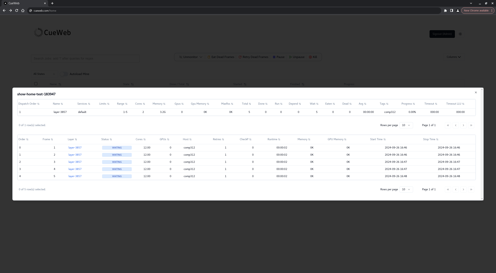
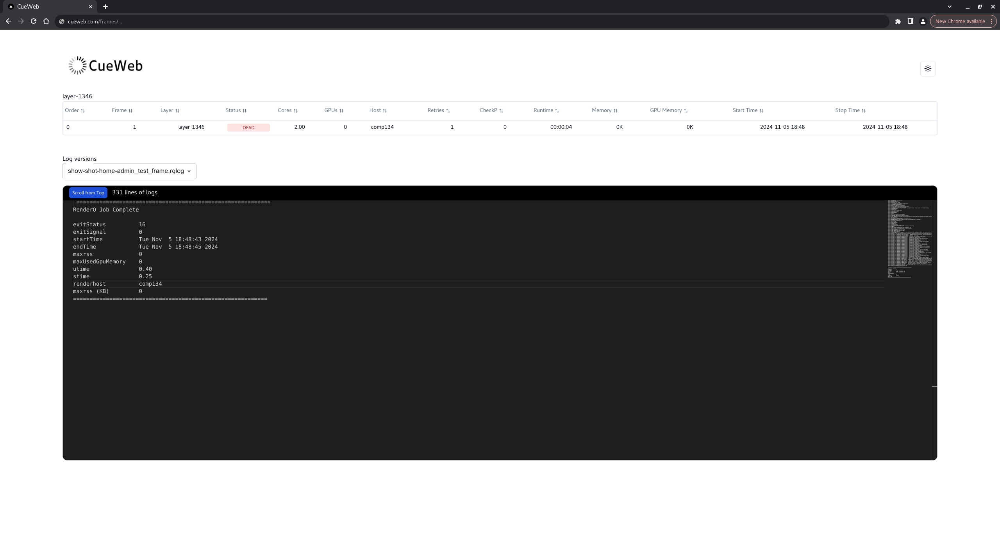

CueWeb System
==============


# Contents

- [Introduction](#introduction)
- [Requirements](#requirements)
- [Installation and Usage](#installation-and-usage)
  - [Step-by-Step Instructions](#step-by-step-instructions)
    - [Setting up environment variables](#setting-up-environment-variables)
    - [Running the application with Docker](#running-the-application-with-docker)
    - [Access the CueWeb System](#access-the-cueweb-system)
  - [Authentication Setup](#authentication-setup)
    - [Configuration](#configuration)
      - [Example: Adding Gitlab authentication](#example-adding-gitlab-authentication)
      - [Custom Login Page](#custom-login-page)
- [Features](#features)
    - [Below are some screenshots of the interface](#below-are-some-screenshots-of-the-interface)
- [Troubleshooting](#troubleshooting)
  - [Support resources](#support-resources)
- [Development](#development)
  - [Contributing](#contributing)
    - [Running application in dev mode with Docker](#running-application-in-dev-mode-with-docker)
    - [Testing application in dev mode with Docker](#testing-application-in-dev-mode-with-docker)

# Introduction

CueWeb is a web-based application that brings the core functionality of [CueGUI](https://github.com/AcademySoftwareFoundation/OpenCue/tree/master/cuegui), including Cuetopia and Cuecommander, to a web-accessible format. This initial version includes most Cuetopia features, with Cuecommander integration planned for the next phase. CueWeb simplifies rendering job management with customizable job tables, advanced filtering, detailed inspections, log viewing, and light/dark mode toggling, making it efficient and accessible across platforms. Finally, CueWeb leverages the [OpenCue REST Gateway](https://github.com/AcademySoftwareFoundation/OpenCue/tree/master/rest_gateway) to provide a REST endpoint for seamless interaction with the OpenCue gRPC API.

CueWeb replicates the core functionality of CueGUI (Cuetopia and Cuecommander) in a web-accessible format, enhancing usability while maintaining the familiar interface that users appreciate. This adaptation supports essential operations such as:

- **User authentication:**
   - Secure login capabilities through Okta, Google, and GitHub.
- **Job management dashboard:**
  - Customizable table views to show or hide specific columns.
  - Filter jobs by state (active, paused, or completed).
  - Monitor or unmonitor jobs across various statuses.
  - Detailed job inspection via pop-ups displaying associated layers and frames.
  - Frame navigation with hyperlinks to logs and data pages.
- **Job search functionality:**
   - Search for jobs using show names followed by a hyphen.
   - Dropdown suggestions for matching jobs based on naming conventions like show1-shot-test_job_123.
   - Regex-enabled search (triggered by !) for advanced query patterns, with a tooltip for guidance.
- **Dark mode toggle:**
   - Allows users to switch between light and dark themes.
- **Optimized search and results loading:**
   - Virtualized lists via FixedSizeList to improve performance.
   - Web worker implementation for filtering, reducing main thread workload.
   - Loading animations and efficient API call handling.
- **Multi-job management:**
   - Add or remove multiple jobs from the dashboard directly from search results.
   - Highlight jobs already in the table with a green indicator.
- **Actions and context menu**
   - Added actions for jobs, layers, and frames, including pause, unpause, retry, kill, and eat dead frames.
   - Option to un-monitor all/selected/finished/paused jobs in the jobs data table.
   - Context-sensitive menus disable options for completed jobs and ensure proper screen rendering.
- **Table auto-reloading:** 
   - All tables (jobs, layers, frames) now update at regular intervals for real-time data.
- **View frame logs:**
   - View previous and current log versions with a dropdown menu for selection
- **Authorization and security:**
   - Authorization headers included in all REST gateway requests.
   - JWT tokens generated securely for API authentication.

Go back to [Contents](#contents).

# Requirements

**Core technologies:**
- **[Node.js](https://nodejs.org):** Essential for server-side logic.
- **[Next.js](https://nextjs.org):** Utilized for server-side rendering and static generation.
- **[Next-Auth.js](https://next-auth.js.org):** Implements authentication mechanisms.
- **[Shadcn UI](https://ui.shadcn.com/):** Used for UI components.

**Operating system compatibility:**
- CueWeb is designed to be platform-independent, functioning seamlessly on macOS, Windows, and Linux. There are no specific OS version requirements.

**Dependency versions:**
- For precise version information on all dependencies, consult the `package.json` file located in the project repository. This resource ensures you have the correct versions of the required libraries to run CueWeb effectively.

**Docker support:**
- If you prefer a containerized environment, ensure [Docker](https://docs.docker.com/get-docker) is installed to facilitate the deployment of CueWeb.

Go back to [Contents](#contents).

# Installation and Usage

Next is the process to install and use the CueWeb system.

## Step-by-Step Instructions

### Setting up environment variables

- To run CueWeb, certain environment variables must be set for the application to run as intended. Set up the following environment variables, either by adding them to the docker file directly (`ENV MY_ENV_VARIABLE="value"`), or adding a `.env` file in `/cueweb` where these variables are configured (if you do the latter, make sure you copy in that file in the docker file i.e: `COPY .env /opt/cueweb/.env`). If your application will be deployed on Openshift, those environment variables can be configured there as well.
    - NEXT_PUBLIC_OPENCUE_ENDPOINT
        - This is a gateway that provides a REST endpoint to the opencue gRPC API. This is needed for jobs, layers, and frames to be retrieved. See [Opencue REST Gateway](https://github.com/AcademySoftwareFoundation/OpenCue/blob/master/rest_gateway/README.md).
        - This means that this rest gateway must be set-up and the environment variable should be set to the url for rest gateway.
    - NEXT_PUBLIC_URL
        - This is the URL where CueWeb is hosted and accessible by users ex: localhost:3000
    - NEXT_JWT_SECRET
        - This is used to create a JWT token which is required to access the REST endpoint of the opencue gRPC API

    - CueWeb authentication environment variables
        - Depending on which [Next-Auth.js](https://next-auth.js.org/) provider you use for authentication, you may have to set certain environment variables. 
        - For example, for authentication (see file `cueweb/lib/auth.ts`), the following environment variables must be set:
            - `NEXT_PUBLIC_AUTH_PROVIDER=github,okta,google` will show the three authentication buttons (Okta, Google, GitHub).
            - `NEXT_PUBLIC_AUTH_PROVIDER=github,google` will show the two authentication buttons (GitHub and Google).
            - `NEXT_PUBLIC_AUTH_PROVIDER=google` will show only the Google (Gmail) authentication button.

            - [Okta](https://www.okta.com/)
                - NEXT_AUTH_OKTA_CLIENT_ID
                - NEXT_AUTH_OKTA_ISSUER
                - NEXT_AUTH_OKTA_CLIENT_SECRET
            - Google (Gmail)
                - GOOGLE_CLIENT_ID
                - GOOGLE_CLIENT_SECRET
            - GitHub
                - GITHUB_ID
                - GITHUB_SECRET
        - To disable the CueWeb authentication, do not define `NEXT_PUBLIC_AUTH_PROVIDER`.
            - Note that all the CueWeb environment variables are defined in build time (`cueweb/Dockerfile`), including the `NEXT_PUBLIC_AUTH_PROVIDER`, so define if the CueWeb will use or not authentication will be defined in the build time.
        Change `.env` from:
        ```env
        # Authentication Configuration:
        NEXT_PUBLIC_AUTH_PROVIDER=github,okta,google
        ```
        to
        ```env
        # Authentication Configuration:
        # NEXT_PUBLIC_AUTH_PROVIDER=github,okta,google
        ```

    - Sentry environment variables
        - If you use [Sentry](https://sentry.io/) system to monitor the CueWeb application, the following environment variables should be set:
            - SENTRY_ENVIRONMENT
            - SENTRY_URL
            - SENTRY_DSN
            - SENTRY_ORG
            - SENTRY_PROJECT
        - If you do not want to use Sentry, do not define `SENTRY_DSN`.
        Change `.env` from:
        ```env
        # Sentry values
        SENTRY_ENVIRONMENT='development'
        SENTRY_DSN = sentrydsn
        SENTRY_URL = sentryurl
        SENTRY_ORG = sentryorg
        SENTRY_PROJECT = sentryproject
        ```
        to
        ```env
        # Sentry values
        SENTRY_ENVIRONMENT='development'
        # SENTRY_DSN = sentrydsn
        SENTRY_URL = sentryurl
        SENTRY_ORG = sentryorg
        SENTRY_PROJECT = sentryproject
        ```

Example of `.env` file (`cueweb/.env.example`):

```env
NEXT_PUBLIC_OPENCUE_ENDPOINT=http://your-rest-gateway-url.com

# Sentry values
SENTRY_ENVIRONMENT='development'
SENTRY_DSN = sentrydsn
SENTRY_URL = sentryurl
SENTRY_ORG = sentryorg
SENTRY_PROJECT = sentryproject

# Authentication Configuration:
NEXT_PUBLIC_AUTH_PROVIDER=github,okta,google
NEXTAUTH_URL=http://localhost:3000
NEXTAUTH_SECRET=canbeanything

# values from Okta OAuth 2.0
NEXT_AUTH_OKTA_CLIENT_ID=oktaid
NEXT_AUTH_OKTA_ISSUER=https://company.okta.com
NEXT_AUTH_OKTA_CLIENT_SECRET=oktasecret

# values from Google Cloud Platform OAuth 2.0
GOOGLE_CLIENT_ID=googleclientid
GOOGLE_CLIENT_SECRET=googleclientsecret

# values from Github OAuth 2.0
GITHUB_ID=githubid
GITHUB_SECRET=githubsecret
```

Go back to [Contents](#contents).

### Running the application with Docker
- Make sure [Docker](https://www.docker.com/) is installed
- A `Dockerfile` is provided in the CueWeb project (`cueweb/Dockerfile`)
- `docker build -f Dockerfile -t cueweb .`
- `docker run -p 3000:3000 -it cueweb`
    - To see a frame's logs, make sure the path to that frame's log directory is accessible within your docker container (if not, you should mount the directory).

Go back to [Contents](#contents).

### Access the CueWeb System

- Open your web browser and navigate to `localhost:3000` or `<ip>:3000` or the configured CueWeb url to start using the CueWeb system. 
- Replace `<ip>` with the actual IP address if you are accessing the system from a different machine in your network.

Go back to [Contents](#contents).

## Authentication Setup 
The CueWeb project utilizes the [NextAuth.js](https://next-auth.js.org/) library for authentication, which includes many popular providers out-of-the-box for additional configuration or for implementing your own email authentication with a custom database. This project already implements Google, Github and Okta authentication and they are enabled if their respective environment variables are provided, otherwise ignored. 

Authentication providers in [NextAuth.js](https://next-auth.js.org/) are services that can be used to sign in to a user.

There are four ways a user can be signed in:

- [Using a built-in OAuth Provider](https://next-auth.js.org/configuration/providers/oauth) (e.g Github, Google, Okta, Apple, GitLab, Amazon, Microsoft Azure, LinkedIn, Atlassian, Auth0, etc...)
   - List of NextAuth.js providers: https://next-auth.js.org/providers/.
- [Using a custom OAuth Provider](https://next-auth.js.org/configuration/providers/oauth#using-a-custom-provider)
- [Using Email](https://next-auth.js.org/configuration/providers/email)
- [Using Credentials](https://next-auth.js.org/configuration/providers/credentials)

Go back to [Contents](#contents).

### Configuration

To enable Okta, Google or Github authentication, simply set the environment variable
`NEXT_PUBLIC_AUTH_PROVIDER` to either `google`, `okta`,`github` or all of them combined seperated by comma
(e.g. `google,okta,github`) along with  the OAuth 2.0 secrets listed in `lib/auth.ts`. 
For example, providing the `GOOGLE_CLIENT_ID`, 
`GOOGLE_CLIENT_SECRET` Google OAuth 2.0 environment variables and setting `NEXT_PUBLIC_AUTH_PROVIDER=google`
will automatically enable google authentication. See `.env.example` on a list of environment variables to provide.

Go back to [Contents](#contents).

#### Example: Adding Gitlab authentication

In `lib/auth.ts`, add the following lines of code:
```tsx
if (process.env.GITLAB_CLIENT_ID && process.env.GITLAB_CLIENT_SECRET) {
  providers.push(
    GitlabProvider({
      clientId: process.env.GITLAB_CLIENT_ID,
      clientSecret: process.env.GITLAB_CLIENT_SECRET
    })
  )
}
```
After this, NextAuth will automatically build and display the Sign In page at `cueweb.com/api/auth/signin`.

For a complete list of available providers, visit here:
- https://next-auth.js.org/providers/

To configure custom authentication:
- https://next-auth.js.org/configuration/providers/oauth#using-a-custom-provider

Go back to [Contents](#contents).

#### Custom Login Page

An Example on how to implement custom login page is shown in `app/login/page.tsx`. To add Google authentication,
simply use the `signIn` function from nextAuth and pass the provider name as parameter.

```tsx
// app/login/page.tsx
import { signIn } from "next-auth/react";
import { GoogleSignInButton } from "@/components/ui/auth-button"

export default function Page() {
    ...
    // SignIn Function: redirects user to google signin page on click 
    const googleLogin = async () => {
        signIn("google", { callbackUrl: "/"});
    };
    ...
    return (
        <div>
            {/*Button with google Icon*/}
            <GoogleSignInButton onClick={googleLogin}/>
        </div>
    );
}
```

Go back to [Contents](#contents).

# Features

The current CueWeb system offers a robust set of features designed to enhance user interaction and productivity:

- **Authentication:** Secure login via Okta, Google, and GitHub.
- **Jobs/layers/frames management:** Customizable tables, state filtering, monitoring, detailed inspections, and log navigation.
- **Search:** Advanced search with regex support, dropdown suggestions, and optimized loading.
- **Dark mode:** Toggle between light and dark themes.
- **Actions:** Job, layer, and frame actions (pause, retry, kill, eat, and others) with context menus.
- **Auto-reloading:** Real-time updates for tables.
- **Logs:** View current and previous logs via dropdown.
- **Security:** Use JWT-based authorization and secure headers.

Go back to [Contents](#contents).

### Below are some screenshots of the interface





Go back to [Contents](#contents).

# Troubleshooting

Next are the support resources.

## Support resources

For assistance and further information:

- **Documentation:** Visit the [OpenCue Official Documentation](https://www.opencue.io/docs/) for comprehensive guides and tutorials.
- **Issue reporting:** Encounter a problem? Report it on our [GitHub issues page](https://github.com/AcademySoftwareFoundation/OpenCue/issues) to get help from the community and our development team.

Go back to [Contents](#contents).

# Development

## Contributing
Submit a pull request [here](https://github.com/AcademySoftwareFoundation/OpenCue/pulls) to contribute to CueWeb.

Go back to [Contents](#contents).

### Running application in dev mode with Docker
- When developing and testing CueWeb locally, it’s best to run `npm run dev` rather than `npm run build` and `npm run start` (this is for creating production builds)
    - `npm run dev` allows for live development, meaning you can make some code changes and see your changes applied right away
- To do so, start container with `bin/sh` as the entry command, and run `npm run dev` within the container to start the server 
    - Comment out the lines below "for production builds" and un-comment “CMD [‘bin/sh’]” in the Dockerfile 
- Run application:
    - sudo docker run -p 3000:3000 \
    -v <path_to_cueweb_repo>:/opt/cueweb \
    -it cueweb

- Don’t forget to mount your local code i.e. don’t forget: `-v <path_to_cueweb_repo>:/opt/cueweb`
    - This is important so that your code changes are picked up

- Make sure environment variables are set

Go back to [Contents](#contents).

### Testing application in dev mode with Docker
- To run the Jest unit tests in Docker, uncomment `CMD ["npm, "run", "test"]` in the Dockerfile or run `npm run test` in the terminal
- Test coverage includes:
    - Loading environment variables and verifying them
    - Creating json web tokens
    - Fetching objects from the gRPC REST gateway and handling errors
    - And more

Go back to [Contents](#contents).
